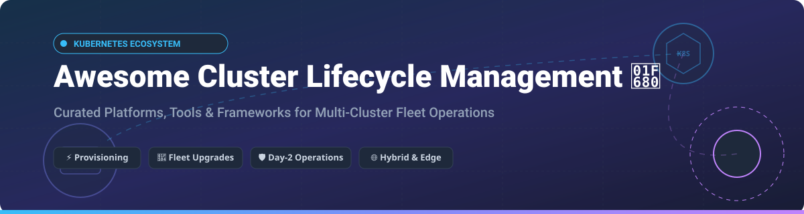

# Awesome Cluster Lifecycle Management 🚀

  

  
  
  
  
  
  
  

## 📌 Top Cluster Lifecycle Management Platforms Ecosystem

**Curated List of SaaS Platforms, Open-Source Tools & Kubernetes Fleet Management Frameworks**

*Focused on Kubernetes Provisioning, Multi-Cluster Management, Declarative Upgrades, Fleet Operations & Day-2 Cluster Operations across Cloud, Bare-Metal, and Edge.*

---

## 📋 Table of Contents

- [☁️ SaaS / Hosted Platforms](#-saashosted-platforms)
- [🔓 Open-Source GitHub Projects](#-open-source-github-projects)
- [🤝 How to Contribute](#-how-to-contribute)
- [☕ Support & Sponsorship](#-support--sponsorship)
- [📈 Star History](#-star-history)
- [⚠️ Disclaimer](#%EF%B8%8F-disclaimer)

---

## ☁️ SaaS / Hosted Platforms

> [!NOTE]
> **Market Insights:** The estimated market size for Kubernetes and Cluster Lifecycle Management software/services is approximately **$4.2 Billion (2026)** and growing rapidly. The sector is **moderately fragmented**, featuring established enterprise cloud providers alongside high-growth specialized vendors (Rancher/SUSE, Spectro Cloud, Platform9, Loft Labs).

| Platform | Description | Enterprise Valuation / Estimated Revenue | Starting Pricing Tier | Free Tier / Trial Limits |
| :--- | :--- | :--- | :--- | :--- |
| **[Canonical Kubernetes](https://ubuntu.com/kubernetes)** | Enterprise Kubernetes lifecycle automation backed by Canonical Juju charms and Ubuntu support. | **~$3.0B Valuation** (~$250M Revenue) | $250 / node / year (Ubuntu Pro Enterprise Support) | **Free forever** for up to 5 nodes (Ubuntu Pro personal tier) |
| **[Rancher (SUSE)](https://www.rancher.com/)** | Enterprise multi-cluster Kubernetes management platform for hybrid, edge, and multi-cloud fleet operations. | **~$2.5B Market Cap** (~$700M Revenue) | $300 / node / year (SUSE Rancher Prime subscription) | **100% Free & Open-Source** self-hosted core edition |
| **[Mirantis Kubernetes Engine](https://www.mirantis.com/)** | Enterprise container and Kubernetes lifecycle management platform with enterprise security and governance. | **~$1.0B Valuation** (~$100M Revenue) | $800 / node / year | **30-day free trial** with full enterprise features |
| **[Platform9](https://platform9.com/)** | SaaS-managed Kubernetes control plane for data center, edge, and public cloud infrastructure. | **~$500M Valuation** (~$35M Revenue) | $150 / node / month (Platform9 Managed) | **Free forever** for up to 3 clusters & 8 nodes |
| **[Spectro Cloud](https://www.spectrocloud.com/)** | Declarative full-stack Kubernetes management platform (Palette) across bare metal, edge, and cloud. | **~$400M Valuation** (~$25M Revenue) | $15 / node / month (Palette SaaS) | **Free 30-day trial** including $500 in cloud credits |
| **[Loft Labs](https://www.loft.sh/)** | Platform for virtual Kubernetes clusters (vCluster), self-service dev environments, and multi-tenancy. | **~$250M Valuation** (~$15M Revenue) | $20 / user / month (vCluster Pro Platform) | **Free forever** for up to 3 users and open-source core |
| **[D2iQ (NutaniX)](https://d2iq.com/)** | Enterprise Kubernetes platform (DKP) delivering multi-cluster lifecycle automation and Day-2 operations. | **~$200M Valuation** (~$30M Revenue) | $1,200 / cluster / year | **30-day enterprise evaluation trial** |
| **[Rafay](https://rafay.co/)** | Multi-cluster Kubernetes operations, fleet governance, policy enforcement, and developer self-service platform. | **~$200M Valuation** (~$15M Revenue) | $45 / node / month | **Free 30-day trial** for up to 5 clusters |
| **[Kubermatic](https://www.kubermatic.com/)** | Automated multi-cluster lifecycle management platform designed for hybrid and multi-cloud infrastructure. | **~$100M Valuation** (~$10M Revenue) | $29 / node / month (Kubermatic Enterprise) | **Free Community Edition** for up to 5 worker clusters |
| **[Giant Swarm](https://www.giantswarm.io/)** | Fully managed Kubernetes platform and platform engineering services for multi-cluster fleet management. | **~$80M Valuation** (~$12M Revenue) | $450 / cluster / month | **Free 30-day guided proof-of-concept sandbox** |

---

## 🔓 Open-Source GitHub Projects

| Project | GitHub_Stars | Description |
| :--- | :---: | :--- |
| **[k3s](https://github.com/k3s-io/k3s)** |  | Lightweight certified Kubernetes distribution designed for IoT, edge, CI/CD, and resource-constrained environments. |
| **[Rancher](https://github.com/rancher/rancher)** |  | Open-source multi-cluster management platform for provisioning and operating Kubernetes fleets across hybrid environments. |
| **[Kubespray](https://github.com/kubernetes-sigs/kubespray)** |  | Production-grade Ansible playbooks to deploy and manage high-availability Kubernetes clusters on cloud or bare metal. |
| **[kOps](https://github.com/kubernetes/kops)** |  | Automated provisioning, upgrading, and maintenance tooling for production-grade Kubernetes clusters on AWS, GCE, and OpenStack. |
| **[vCluster](https://github.com/loft-sh/vcluster)** |  | Fully functional virtual Kubernetes clusters that run inside namespaces of a host cluster for fast multi-tenancy. |
| **[Talos Linux](https://github.com/siderolabs/talos)** |  | Secure, immutable, and minimal Linux distribution built specifically for running Kubernetes clusters cleanly. |
| **[MicroK8s](https://github.com/canonical/microk8s)** |  | Small, fast, single-package zero-ops Kubernetes distribution for workstation, IoT, edge, and cloud deployments. |
| **[k0s](https://github.com/k0sproject/k0s)** |  | Zero-friction, single-binary Kubernetes distribution packaged without external dependencies for any environment. |
| **[Cluster API](https://github.com/kubernetes-sigs/cluster-api)** |  | Declarative APIs and tooling (CAPI) to provision, upgrade, and operate multiple Kubernetes clusters declaratively. |
| **[kubeadm](https://github.com/kubernetes/kubeadm)** |  | Official Kubernetes tool for bootstrapping clusters following best practices on physical or virtual machines. |
| **[RKE2](https://github.com/rancher/rke2)** |  | Next-generation security and compliance focused enterprise Kubernetes distribution (also known as RKE Government). |
| **[Kamaji](https://github.com/clastix/kamaji)** |  | Open-source multi-tenant Kubernetes control plane manager that turns worker nodes into managed tenant clusters. |

---

## 🛠️ Architecture & Best Practices

- **Declarative Operations:** Standardize on **Cluster API (CAPI)** or **kOps** manifests for infrastructure-agnostic, GitOps-driven cluster lifecycle management.
- **Fleet Management:** Utilize **Rancher** or **Spectro Cloud Palette** as unified multi-cluster control planes for governance, security policies, and RBAC.
- **Edge & Lightweight Deployments:** Deploy **k3s**, **k0s**, or **MicroK8s** for resource-constrained edge locations and developer sandboxes.
- **Virtualization & Multi-tenancy:** Leverage **vCluster** or **Kamaji** to host isolated virtual control planes on shared physical clusters, reducing infrastructure overhead.

---

## 🤝 How to Contribute

Contributions are always welcome! 

1. 🍴 **Fork** the repository.
2. 📝 Add your project or SaaS platform to `README.md` maintaining table formats and sorting order.
3. 🔍 Ensure descriptions are clear, accurate, and include starting pricing / Stars_Count links.
4. 🚀 Open a **Pull Request** with a brief summary of the added resource.

---

## ☕ Support & Sponsorship

If you find this repository helpful for your platform engineering, SRE, or DevOps workflows, please consider supporting the project!

- ⭐ **Star** this repository to help others discover it.
- 🔄 **Share** it with your colleagues and cloud-native communities.
- 💖 **Sponsor** the project or buy me a coffee via the [GitHub Sponsor Dashboard](https://github.com/sponsors/ishandutta2007).

---

## 📈 Star History

---

## ⚠️ Disclaimer

- This list is **community-curated** for informational purposes only. Inclusion does not constitute an endorsement.
- Cluster lifecycle tools control critical production infrastructure. Always test tooling thoroughly in non-production environments before deploying at scale.

---

  Made with ❤️ for Platform Engineers, SREs, and Cloud-Native Advocates worldwide.

